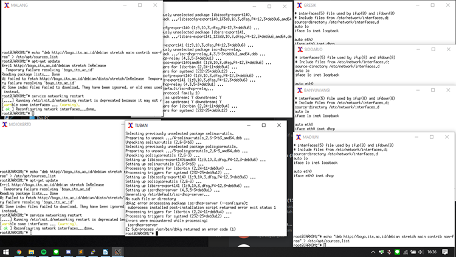
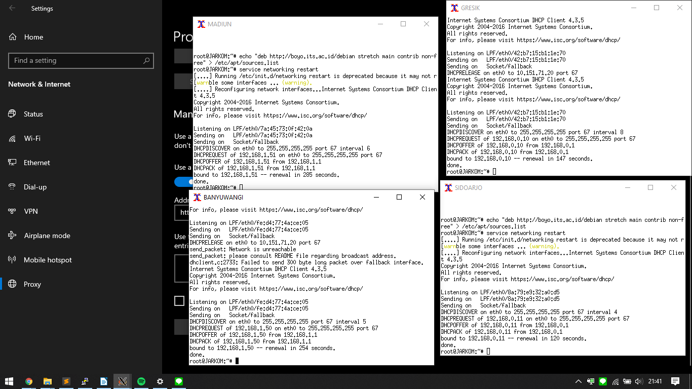
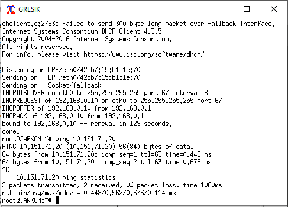

# Jarkom_Modul3_Lapres_E1

## DHCP
**Nomor 1**

### Topologi.sh
    
    # Switch
    uml_switch -unix switch1 > /dev/null < /dev/null &
    uml_switch -unix switch2 > /dev/null < /dev/null &
    uml_switch -unix switch3 > /dev/null < /dev/null &
    
    # Router
    xterm -T SURABAYA -e linux ubd0=SURABAYA,jarkom umid=SURABAYA eth0=tuntap,,,10.151.70.9 eth1=daemon,,,switch2 eth2=daemon,,,switch3 eth3=daemon,,,switch1 mem=256M &
    
    # Server
    xterm -T MALANG -e linux ubd0=MALANG,jarkom umid=MALANG eth0=daemon,,,switch2 mem=160M &
    xterm -T MOJOKERTO -e linux ubd0=MOJOKERTO,jarkom umid=MOJOKERTO eth0=daemon,,,switch2 mem=128M &
    xterm -T TUBAN -e linux ubd0=TUBAN,jarkom umid=TUBAN eth0=daemon,,,switch2 mem=128M &
    
    # Klien
    xterm -T SIDOARJO -e linux ubd0=SIDOARJO,jarkom umid=SIDOARJO eth0=daemon,,,switch1 mem=64M &
    xterm -T GRESIK -e linux ubd0=GRESIK,jarkom umid=GRESIK eth0=daemon,,,switch1 mem=64M &
    
    xterm -T BANYUWANGI -e linux ubd0=BANYUWANGI,jarkom umid=BANYUWANGI eth0=daemon,,,switch3 mem=64M &
    xterm -T MADIUN -e linux ubd0=MADIUN,jarkom umid=MADIUN eth0=daemon,,,switch3 mem=64M &


### Network interfaces

[Surabaya]

    auto lo
    iface lo inet loopback
    
    auto eth0
    iface eth0 inet static
    address 10.151.70.10
    netmask 255.255.255.252
    gateway 10.151.70.9
    
    auto eth1
    iface eth2 inet static
    address 192.168.0.1
    netmask 255.255.255.0
    
    auto eth2
    iface eth2 inet static
    address 192.168.1.1
    netmask 255.255.255.0
    
    auto eth3
    iface eth1 inet static
    address 10.151.71.17
    netmask 255.255.255.248

[Surabaya extra config]

nano /etc/sysctl.conf

Hilangkan tanda pagar (#) pada bagian net.ipv4.ip_forward=1

sysctl -p

[MALANG]

    auto lo
    iface lo inet loopback

    auto eth0
    iface eth0 inet static
    address 10.151.71.18
    netmask 255.255.255.248
    gateway 10.151.71.17

[MOJOKERTO]
    
    auto lo
    iface lo inet loopback
    
    auto eth0
    iface eth0 inet static
    address 10.151.71.19
    netmask 255.255.255.248
    gateway 10.151.71.17

[TUBAN]

    auto lo
    iface lo inet loopback
    
    auto eth0
    iface eth0 inet static
    address 10.151.71.20
    netmask 255.255.255.248
    gateway 10.151.71.17

[GRESIK]

    auto lo 
    iface lo inet loopback
    
    auto eth0
    iface eth0 inet dhcp

[SIDOARJO]

    auto lo
    iface lo inet loopback
    
    auto eth0
    iface eth0 inet dhcp

[BANYUWANGI]
    
    auto lo
    iface lo inet loopback
    
    auto eth0
    iface eth0 inet dhcp

[MADIUN]

    auto lo
    iface lo inet loopback
    
    auto eth0
    iface eth0 inet dhcp

### iptables

nano iptables.sh

[iptables]

    #!/bin/sh
    iptables -t nat -A POSTROUTING -o eth0 -j MASQUERADE -s 192.168.0.0/16
    iptables -t nat -A POSTROUTING -o eth0 -j MASQUERADE -s 192.168.1.0/16

sources.list

[sources.list]

    echo "deb http://boyo.its.ac.id/debian stretch main contrib non-free" > /etc/apt/sources.list

 

**Nomor 2**

install isc-dhcp-relay di Surabaya

masukkan IP TUBAN (10.151.71.20)

masukkan eth1 eth2 untuk interfaces to listen to.

Install isc-dhcp-server di Surabaya

3. Client pada subnet 1 mendapatkan range IP dari 192.168.0.10 sampai 192.168.0.100 dan 192.168.0.110 sampai 192.168.0.200.
4. Client pada subnet 3 mendapatkan range IP dari 192.168.1.50 sampai 192.168.1.70.
5. Client mendapatkan DNS Malang dan DNS 202.46.129.2 dari DHCP
6. Client di subnet 1 mendapatkan peminjaman alamat IP selama 5 menit, sedangkan client pada subnet 3 mendapatkan peminjaman IP selama 10 menit.

nano /etc/dhcp/dhcpd.conf

    # file content dhcpd.conf
    subnet 192.168.0.0 netmask 255.255.255.0 {
      range 192.168.0.10 192.168.0.100;
      range 192.168.0.110 192.168.0.200;
      option routers 192.168.0.1;
      option broadcast-address 192.168.0.255;
      option domain-name-servers 202.46.129.2;
      option domain-name-servers 10.151.71.18;
      default-lease-time 300;
      max-lease-time 3600;
    }
    subnet 192.168.1.0 netmask 255.255.255.0 {
      range 192.168.1.50 192.168.1.70;
      option routers 192.168.0.1;
      option broadcast-address 192.168.0.255;
      option domain-name-servers 202.46.129.2;
      option domain-name-servers 10.151.71.18;
      default-lease-time 600;
      max-lease-time 7200;
    }
    #

Mengapa kita buat 2? Padahal kita mau buat relay saja ke 192.168.0.0/24, 192.168.0.1/24. Kalau kita hanya buat ke relaynya saja nanti dhcp servernya tidak mau running.

Source https://www.pancacourse.id/2019/06/lab-10-tkj-linux-membuat-dhcp-relay-di.html

service isc-dhcp-server restart


Gresik coba dhcp request tapi tidak di answer.


Kita coba kembali test koneksi para client, ditemukan gresik tidak bisa ping surabaya dan banyuwangi bisa ping surabaya.
Setelah dikaji ulang ditemukan topologi.sh nya salah

    xterm -T SURABAYA -e linux ubd0=SURABAYA,jarkom umid=SURABAYA eth0=tuntap,,,10.151.70.9 eth1=daemon,,,switch1 eth2=daemon,,,switch3 eth3=daemon,,,switch2 mem=256M &

switch eth1 sama eth 3 terbalik


coba dhcp nya

masih tidak bisa. DHCP request nya not found

setelah otak atik 3 jam tiba-tiba bisa dengan config sebagai berikut

[SURABAYA]

nano /etc/default/isc-dhcp-relay

    #
    SERVERS="10.151.71.20"
    INTERFACES="eth1 eth2 eth3"
    #

[TUBAN]

nano /etc/default/isc-dhcp-server

    #
    INTERFACES="eth0"
    #

cp /etc/dhcp/dhcpd.conf .

nano /etc/dhcp/dhcpd.conf

service isc-dhcp-server restart

    # file content dhcpd.conf
    subnet 10.151.71.16 netmask 255.255.255.248 {
      range 10.151.71.17 10.151.71.22;
      option routers 10.151.71.20; # interface TUBAN
      option broadcast-address 10.151.71.23;
      option domain-name-servers 202.46.129.2, 10.151.71.18;
      default-lease-time 3600;
      max-lease-time 3600;
    }
    subnet 192.168.0.0 netmask 255.255.255.0 {
      range 192.168.0.10 192.168.0.100;
      range 192.168.0.110 192.168.0.200;
      option routers 10.151.71.17; # interface Surabaya subnet 1 eth 1
      option broadcast-address 192.168.0.255;
      option domain-name-servers 202.46.129.2, 10.151.71.18;
      default-lease-time 300;
      max-lease-time 3600;
    }
    subnet 192.168.1.0 netmask 255.255.255.0 {
      range 192.168.1.50 192.168.1.70;
      option routers 10.151.71.17; # interface Surabaya subnet 1 eth 1
      option broadcast-address 192.168.1.255;
      option domain-name-servers 202.46.129.2, 10.151.71.18;
      default-lease-time 600;
      max-lease-time 7200;
    }
    #

jangan lupa restart service

service networking restart



## Proxy

**7. User autentikasi**

milik Anri memiliki format:

User: userta_e01

Password: inipassw0rdta_e01

pertama install dulu

apt-get install apache2-utils -y

htpasswd -c /etc/squid/passwd userta_e01

dengan password: inipassw0rdta_e01

[time restrict]

nano /etc/squid/acl.conf

**8. setiap hari Selasa-Rabu pukul 13.00-18.00**

    acl AVAILABLE_WORKING time TW 13:00-18:00

**9. setiap hari Selasa-Kamis pukul 21.00 - 09.00**

    acl AVAILABLE_WORKING2 time TWH 21:00-23:59
    acl AVAILABLE_WORKING3 time WHF 00:00-09:00

**10. google.com, maka akan di redirect menuju monta.if.its.ac.id**

[website redirect]

    # langunsg masuk ke squid.conf
    acl REDIRSITE dstdomain google.com
    http_access deny REDIRSITE
    deny_info 301:http://monta.if.its.ac.id REDIRSITE

[squid.conf]

nano /etc/squid/squid.conf

    # file content squid.conf
    include /etc/squid/acl.conf
    
    # default configuration
    http_port 8080
    visible_hostname mojokerto
    
    # auth
    auth_param basic program /usr/lib/squid/basic_ncsa_auth /etc/squid/passwd
    auth_param basic children 5
    auth_param basic realm Proxy
    auth_param basic credentialsttl 2 hours
    auth_param basic casesensitive on
    acl USERS proxy_auth REQUIRED
    
    # website redirect
    acl REDIRSITE dstdomain google.com
    http_access deny REDIRSITE
    deny_info 301:http://monta.if.its.ac.id REDIRSITE
    
    http_access allow USERS AVAILABLE_WORKING
    http_access allow USERS AVAILABLE_WORKING2
    http_access allow USERS AVAILABLE_WORKING3
    #

service squid restart

**12. DNS**

menggunakan proxy cukup dengan mengetikkan domain janganlupa-ta.301.pw dan memasukkan port 8080

website point ke MOJOKERTO janganlupa-ta.e01.pw

[MALANG]

apt-get install bind9 -y

nano /etc/bind/named.conf.local

    # file content /etc/bind/named.conf.local
    zone "janganlupa-ta.e01.pw" {
	    type master;
	    file "/etc/bind/jarkom/janganlupa-ta.e01.pw";
    };
    #

mkdir /etc/bind/jarkom

cp /etc/bind/db.local /etc/bind/jarkom/janganlupa-ta.e01.pw

nano /etc/bind/jarkom/janganlupa-ta.e01.pw

    # file content /etc/bind/jarkom/janganlupa-ta.e01.pw
    @	IN	NS	janganlupa-ta.e01.pw.
    @	IN	A	10.151.71.19	;IP MOJOKERTO
    #

service bind9 restart

Coba test config dns, tapi ip malang unreachable dari gresik.


Hiya hiya hiya misterius sekali kawan errornya

hipotesis: default gatewaynya salah… Seharusnya… Tapi kan dhcp, berarti dhcp nya yang salah. Ternyata option routers diatas salah copas, harusnya pakai interface dari relay ke subnet masing-masing.

    subnet 192.168.0.0 netmask 255.255.255.0 {
    ...
        option routers 192.168.0.1; # interface Surabaya subnet 1 eth 1
    ...
    } 
    subnet 192.168.1.0 netmask 255.255.255.0 {
    ...
        option routers 192.168.1.1; # interface Surabaya subnet 2 eth 3
    ...
    }


 
> dora-berhasil.gif

ip google harus di comment dulu biar ga resolv janganlupa-ta.e01.pw ke dns google awkwakwaka

[Nomor 12 DNS success]


[time restrict success]
 


[auth success]

 

[website redirect success]


**Nomor 11**

[custom squid error page]

cd /usr/share/squid/errors/English

wget 10.151.36.202/error403.tar.gz

tar -xvf error403.tar.gz

mv error403/* ./

cp error403.html /usr/share/squid/errors/English/ERR_ANY

nano /etc/squid/squid.conf

    # tambah baris di squid.conf
    error_directory /usr/share/squid/errors/English/
    # untuk custom error
    http_access deny all
    deny_info ERR_ANY all
    #

service squid restart


gambar jalan di request sendiri, yang terblokir oleh squid.

jadi, kalau mau di bagian ini kita harus ganti image url jadi langsung cantumkan image data. Maka hasilnya seperti ini

nano ERR_ANY

```
<!DOCTYPE html>
<html lang="en">
<head>
    <title>Denied From Mojokerto</title>
    <style type="text/css">
    body, html {
        height: 100%;
        margin: 0;
    }
    .bg {
        /* The image used */
        background-image: "data:image/png;base64,  {DATA BASE64 DARI ERROR.JPG}";

        /* Full height */
        height: 100%;

        /* Center and scale the image nicely */
        background-position: center;
        background-repeat: no-repeat;
        background-size: cover;
    }
    </style>
</head>
<body>
    <div class="bg"></div>
</body>
</html>
```

Untuk prosesnya bisa dengan cara ini

nano /usr/share/squid/errors/English/ERR_ANY

nano /usr/share/squid/errors/English/ERR_ANY

```
#
<!DOCTYPE html>
<html lang="en">
<head>
    <title>Denied From Mojokerto</title>
    <style type="text/css">
    body, html {
        height: 100%;
        margin: 0;
    }
    .bg {
        /* The image used */
        background-image: "data:image/png;base64,
#
```

base64 -w 0 error.jpg >> ERR_ANY

nano /usr/share/squid/errors/English/ERR_ANY

```
# hapus new line sebelum comma diatas terus tutup string base64 nya dengan '";''
##  append to ERR_ANY file
";

        /* Full height */
        height: 100%;

        /* Center and scale the image nicely */
        background-position: center;
        background-repeat: no-repeat;
        background-size: cover;
    }
    </style>
</head>
<body>
    <div class="bg"></div>
</body>
</html>
```


karena stringnya kepanjangan jadi html nya ga ke load.

Udah dicoba pake ganti url di

nano /usr/share/squid/mime.conf

    # add in mime.conf
    \.uwaicon1$     application/uwa-image-1         error.jpg
    #

cp error403.jpg /usr/share/squid/icons/

hasilnya

nano /usr/share/squid/errors/English/ERR_ANY

    # change .html file
    "http://janganlupa-ta.e01.pw:8080/squid-internal-static/icons/error.jpg"

hasilnya response kosong.

HABIS ITU SOAL SHIFT NYA DIREVISI 

bind9 sama squidnya corrupt 

Cukup lakukan step-step tersebut

cd /usr/share/squid/errors/English

rm ERR_ACCESS_DENIED

wget 10.151.36.202/ERR_ACCESS_DENIED

nano /etc/squid/squid.conf

    # tambah baris di squid.conf
    error_directory /usr/share/squid/errors/English/
    #


